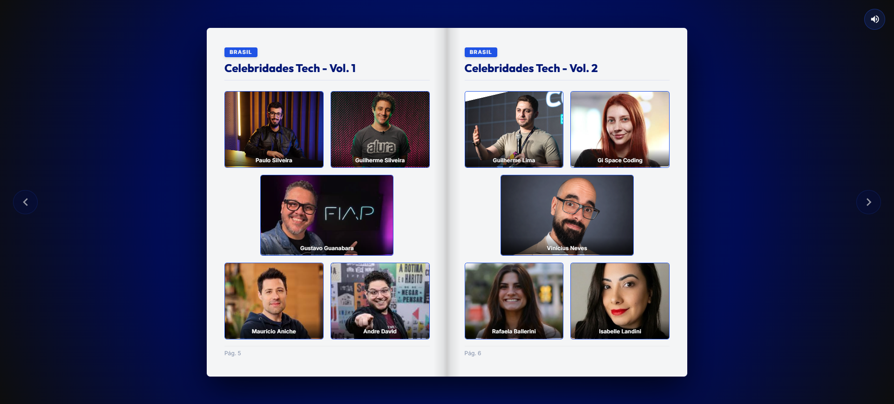

# 📖 Álbum Interativo – Copa do Mundo Tech

<div align="center">



</div>

<br>


> Projeto desenvolvido durante a **Imersão Arquitetura Web com IA** da **Alura**, com o objetivo de compreender, na prática, como funciona a comunicação entre **Frontend**, **Backend** e **APIs REST**, construindo uma aplicação web completa.

---

## 🚀 Sobre o projeto

O **Álbum Interativo – Copa do Mundo Tech** é uma aplicação web que simula um álbum digital de figurinhas reunindo grandes nomes da tecnologia.

O frontend consome uma API desenvolvida com **FastAPI**, responsável por disponibilizar os dados das figurinhas e servir as imagens dinamicamente. A aplicação demonstra conceitos fundamentais de arquitetura web, desde a requisição HTTP até a renderização das informações no navegador.

---

## ✨ Funcionalidades

- 📖 Álbum digital interativo
- 🔄 Consumo de API REST utilizando Fetch API
- 🖼️ Carregamento dinâmico das figurinhas
- 📂 Servidor de imagens utilizando FastAPI
- 📱 Interface responsiva
- 🔊 Efeito sonoro na troca de páginas
- 🌐 Comunicação entre Frontend e Backend
- ⚡ Servidor único para API e arquivos estáticos

---

## 🛠 Tecnologias utilizadas

### Backend

- Python
- FastAPI
- Uvicorn
- CORS Middleware
- StaticFiles
- FileResponse

### Frontend

- HTML5
- CSS3
- JavaScript (ES6+)
- Fetch API

---

## 🏗 Arquitetura da aplicação

```text
             Navegador
                  │
                  │ HTTP
                  ▼
        Frontend (HTML/CSS/JS)
                  │
          Requisições Fetch
                  ▼
        Backend (FastAPI)
                  │
      ┌───────────┴───────────┐
      │                       │
API REST               Imagens das Figurinhas
      │                       │
      └───────────┬───────────┘
                  ▼
             Navegador
```

---

## 📂 Estrutura do projeto

```text
imersao-alura/
│
├── backend/
│   ├── figurinhas/
│   ├── main.py
│   └── requirements.txt
│
├── frontend/
│   ├── index.html
│   ├── app.js
│   └── style.css
│
├── README.md
└── .gitignore
```

---

## 🔗 Endpoints

### Listar todas as figurinhas

```http
GET /figurinhas
```

Resposta:

```json
[
  {
    "id": 1,
    "nome": "Alan Turing",
    "categoria": "IA",
    "imagem_url": "/figurinhas/1/imagem"
  }
]
```

---

### Buscar imagem de uma figurinha

```http
GET /figurinhas/{id}/imagem
```

Exemplo:

```http
GET /figurinhas/1/imagem
```

---

## 📚 Conceitos aplicados

Durante o desenvolvimento foram aplicados conceitos como:

- Arquitetura Cliente-Servidor
- APIs REST
- Comunicação HTTP
- FastAPI
- Servir arquivos estáticos
- Middleware CORS
- Manipulação do DOM
- Consumo de APIs com JavaScript
- Programação assíncrona
- Organização entre Frontend e Backend

---

## ▶️ Como executar o projeto

### Clone o repositório

```bash
git clone https://github.com/IsabelleLandini/imersao-alura.git
```

Entre na pasta do projeto:

```bash
cd imersao-alura/backend
```

Instale as dependências:

```bash
pip install -r requirements.txt
```

Execute a aplicação:

```bash
uvicorn main:app --reload
```

Abra no navegador:

```
http://127.0.0.1:8000
```

---

## 🎯 Objetivos de aprendizagem

Este projeto foi desenvolvido para consolidar conhecimentos sobre:

- construção de APIs utilizando FastAPI;
- integração entre frontend e backend;
- consumo de APIs REST;
- organização de aplicações web em múltiplas camadas;
- arquitetura cliente-servidor;
- manipulação dinâmica de dados no navegador.


---

## 👩‍💻 Desenvolvido por

**Isabelle Landini**

---

## 📄 Licença

Este projeto foi desenvolvido para fins educacionais durante a **Imersão Arquitetura Web com IA** da **Alura**.
